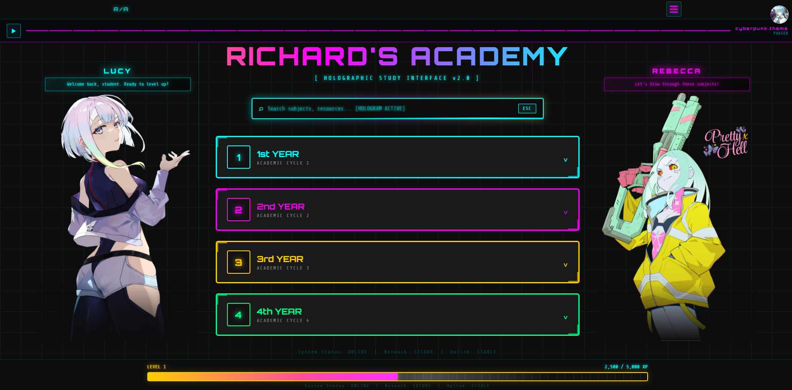
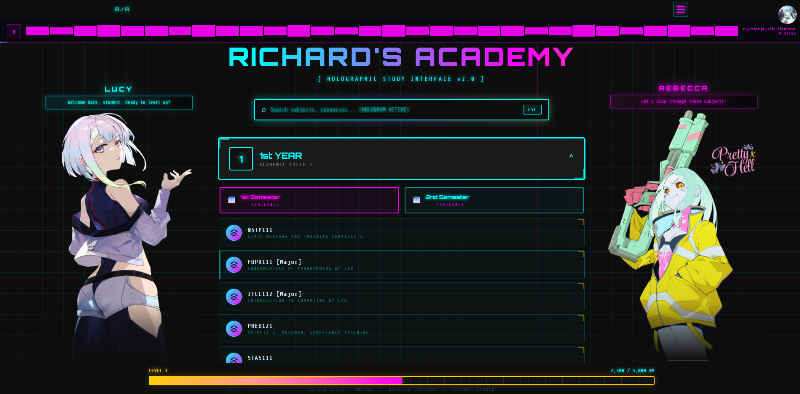
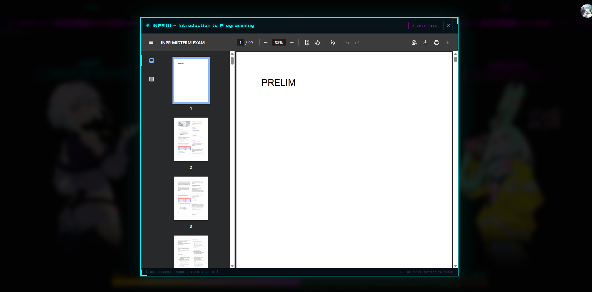
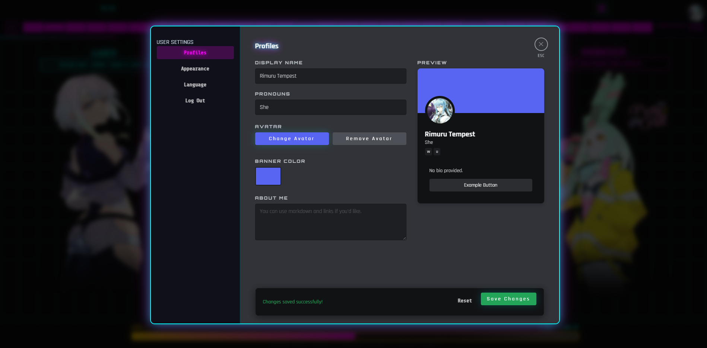

Reviewer for all years, this project presents a visually engaging and interactive holographic study interface, designed to organize academic modules and resources with a distinct futuristic aesthetic.

<h2>✨ Features</h2>
<ul>
<li><strong>Holographic UI:</strong> A unique cyberpunk-themed interface with dynamic visual effects.</li>
<li><strong>Organized by Year and Semester:</strong> Navigate through academic content logically structured by year level and semester.</li>
<li><strong>Interactive Subject Cards:</strong> Clickable cards display course codes and descriptions, leading to detailed module information.</li>
<li><strong>In-Page File Viewer:</strong> Integrated viewer for PDFs and PPTX files, allowing for seamless access to study materials.</li>
<li><strong>XP Progression System:</strong> Gamified experience with level progression tied to academic year advancement.</li>
<li><strong>Ambient Music Player:</strong> An integrated music player with a cyberpunk theme to enhance the study environment.</li>
<li><strong>Responsive Design:</strong> Fully adaptable interface for both desktop and mobile devices.</li>
<li><strong>Multilingual Support:</strong> Localization options for various languages, enhancing accessibility.</li>
<li><strong>User Settings:</strong> Customizable profile settings including display name, pronouns, avatar, and accent color.</li>
</ul>
<h2>Preview</h2>

<h2>🛠️ Tech Stack</h2>
<ul>
<li><strong>Languages:</strong> HTML, CSS, JavaScript</li>
<li><strong>Frameworks:</strong> Next.js, TypeScript, Node.js (implied by project structure and potential backend interactions, though not explicitly used in frontend code)</li>
<li><strong>Styling:</strong> Custom CSS with focus on cyberpunk aesthetics and animations</li>
</ul>
<h2>🚀 Installation</h2>

This project is a front-end application and does not require a complex installation process. To run it locally:

<ol>
<li>
<strong>Clone the repository:</strong>

<pre><code class="language-bash">git clone https://github.com/Lucy2007-bsit/Richard-s-Academy.git
cd Richard-s-Academy
</code></pre>
</li>
<li>
<strong>Open <code>index.html</code>:</strong> Open the <code>index.html</code> file directly in your web browser. No server or build process is required for basic viewing.

</li>
</ol>
<h2>📚 Usage</h2>

This holographic study interface is designed to be an intuitive academic resource hub. Users can:

<ol>
<li><strong>Navigate Through Years:</strong> Click on the year blocks (1st YEAR, 2nd YEAR, etc.) to expand and reveal the semesters.</li>
<li><strong>Access Semesters:</strong> Click on available semester blocks to view the list of subjects.</li>
<li><strong>View Subject Modules:</strong> Click on a subject card to open its associated files in the integrated viewer.</li>
<li><strong>Use the Search Bar:</strong> Filter subjects by typing keywords in the search bar at the top.</li>
<li><strong>Control Music:</strong> Use the music bar at the top to play/pause the background music.</li>
<li><strong>Customize Settings:</strong> Click the profile icon in the top right corner to access user settings for language, profile details, and appearance.</li>
</ol>
<h3>Example: Accessing a Subject Module</h3>
<ol>
<li>Click on the <strong>1st YEAR</strong> block.</li>
<li>Click on the <strong>2nd Semester</strong> block.</li>
<li>Click on the <strong><code>WBDV111 [Major]</code></strong> subject card.</li>
<li>The file viewer will open, allowing you to browse the modules.</li>
</ol>
<h2>📁 Project Structure</h2>
<pre><code>Richard-s-Academy/
├── audio/
│   ├── lucy-maxlevel.mp3
│   ├── lucy-year1.mp3
│   ├── lucy-year2.mp3
│   ├── lucy-year3.mp3
│   ├── sfx-menu.mp3
│   ├── sfx-select.mp3
│   └── sfx-sem-open.mp3
├── files/
│   ├── 1st Year/
│   │   ├── 1st Sem/
│   │   │   ├── FOPR/
│   │   │   │   └── Prelims to Finals/
│   │   │   │       ├── ... (PDF files)
│   │   ├── 2nd Sem/
│   │   │   ├── INPR/
│   │   │   │   └── All season/
│   │   │   │       └── ... (PDF files)
│   │   │   ├── PCDL/
│   │   │   │   ├── Finals/
│   │   │   │   │   └── ... (PDF files)
│   │   │   │   ├── Midterms/
│   │   │   │   │   └── ... (PDF files)
│   │   │   │   └── Prelims/
│   │   │   │       └── ... (PDF files)
│   │   │   ├── WBDV/
│   │   │   │   ├── Finals/
│   │   │   │   │   └── ... (PDF files)
│   │   │   │   ├── Midterms/
│   │   │   │   │   └── ... (PDF files)
│   │   │   │   └── Prelims/
│   │   │   │       └── ... (PDF files)
│   ├── images/
│   │   ├── lucy2.png
│   │   └── rebecca2.png
├── README.md
├── homepage.css
├── index.html
├── language.js
└── script.js
</code></pre>
<h2>💡 Important Links</h2>
<ul>
<li><strong>Live Demo:</strong> Not explicitly provided, but the <code>index.html</code> can be opened directly in a browser.</li>
<li><strong>Repository:</strong> <a href="https://github.com/Lucy2007-bsit/Richard-s-Academy">Lucy2007-bsit/Richard-s-Academy</a></li>
</ul>
<h2>📄 License</h2>

This project is not explicitly licensed. Please refer to the repository for any licensing information.

<h2>footer</h2>

© 2023 Richard&#39;s Academy. All rights reserved.

<ul>
<li><strong>Repository:</strong> <a href="https://github.com/Lucy2007-bsit/Richard-s-Academy">Richard-s-Academy</a></li>
<li><strong>Author:</strong> Richard Manzano Jr.</li>
<li><strong>Contact:</strong> <a href="mailto:ricardomanzanojr778@email.com">ricardomanzanojr778@email.com</a></li>
<li><strong>Fork us on GitHub!</strong> ⭐ Like us! 🌟 Report Issues! 🐞</li>
</ul>

  
